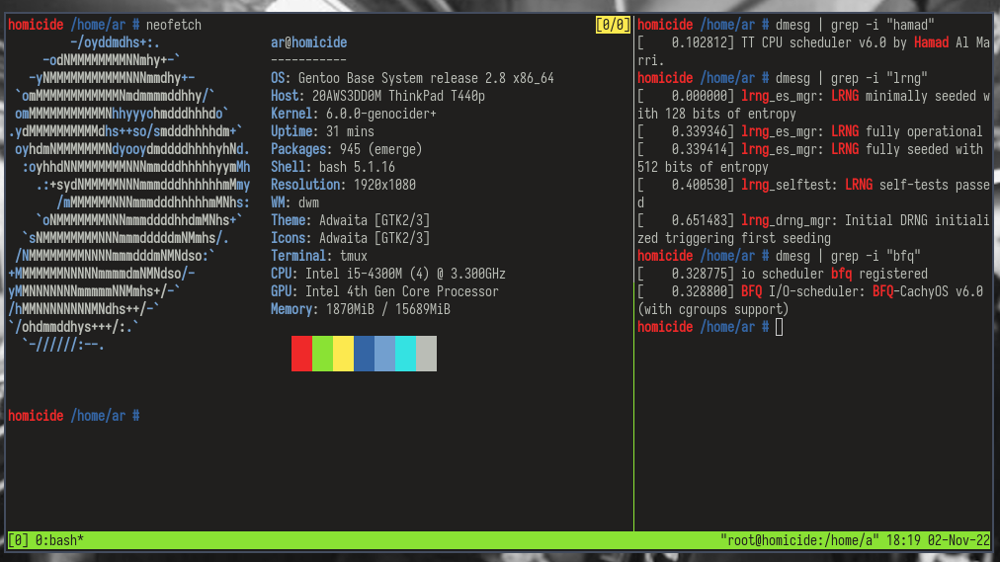

## Klandestin 6.0.0 Kernel Config


Klandestin adalah patchset kernel pribadi yang sudah diatur seoptimalisasi mungkin.
- Clang Full Link Time Optimization
- -O3 flag
- BBRv2 Google
- MG LRU
- LRNG
- TT Scheduler
- March=haswell // ganti sesuai cpu anda
- 1666Hz
- -Ck patchset
- THP Shrinker
- Clear Linux

**Dimohon memasang Clang**

### Unduh Kode Sumber Kernel Linux
```
# wget https://cdn.kernel.org/pub/linux/kernel/v6.x/linux-6.0.tar.gz
# tar -xf linux-6.0.tar.gz
```

### Clone Repo Ini
```
root # cd linux-6.0.tar.gz
root - linux-6.0 # git clone https://github.com/al1r4d/klandestin
```

### Patch dan Load Config Kernel
```
root - linux-6.0 # cd klandestin
root - klandestin # cp .config ../.config
```
```
root - linux-6.0 # patch -p1 < klandestin/semua_patch_yang_diunduh.patch
```

### Kompilasi dan Install Kernel
```
root - linux-6.0 # make LLVM=1 -j4 -l4 && make LLVM=1 modules_install && make LLVM=1 install
```

### Perbarui Grub2 Bootloader
```
root # grub-mkconfig -o /boot/grub/grub.cfg
```

